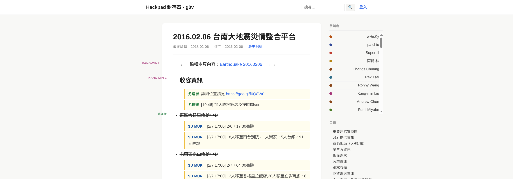
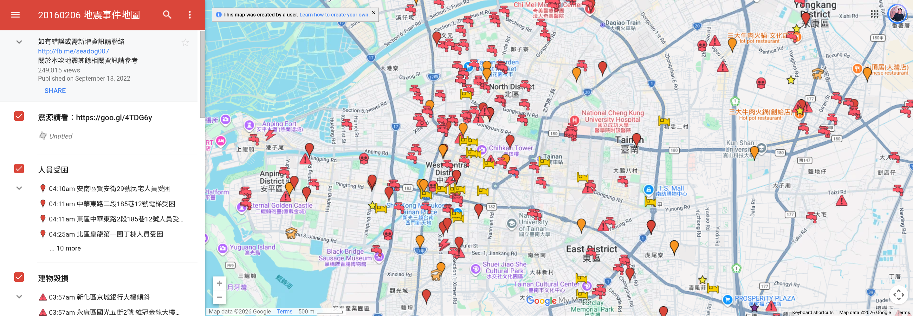

<script async src="https://www.googletagmanager.com/gtag/js?id=G-SJL6EQRW3V"></script>
<script>
  window.dataLayer = window.dataLayer || [];
  function gtag(){dataLayer.push(arguments);}
  gtag('js', new Date());

  gtag('config', 'G-SJL6EQRW3V');
</script>

<!-- _class: cover -->

<div class="cover-art"></div>
<div class="eyebrow">公民科技協力場 / Civic Action Hub</div>

# 防災 GIS<br>資料開箱與應用

<p class="cover-subtitle">從開放圖資，到有用的防災行動</p>
<div class="cover-agenda"><span>讀懂資料</span><i>→</i><span>選對工具</span><i>→</i><span>做出地圖</span></div>
<div class="speaker">Denny Huang<span class="speaker-note">線上說明會暨防災服務設計培力工作坊 · 30 分鐘</span></div>

---

<!-- _class: link -->
<!-- _paginate: false -->

<div class="eyebrow">SLIDES / 投影片連結</div>

# 投影片

<div class="link-grid">
  <div>
    <p class="subtitle">防災 GIS 資料開箱與應用</p>
    <h2 class="slide-url"><a href="https://denny.one/20261002-gis/">denny.one/20261002-gis/</a></h2>
  </div>
  <a class="link-qr" href="https://denny.one/20261002-gis/"></a>
</div>

---

<!-- _class: intro -->

# Denny Huang

- <a href="https://sitcon.org/" target="_blank">SITCON 學生計算機年會</a> 共同發起人
- <a href="https://coscup.org/" target="_blank">COSCUP 開源人年會</a> 長期志工
- <a href="https://hitcon.org/" target="_blank">HITCON 台灣駭客年會</a>  長期志工
- GDG Cloud Taipei Organizer
- 曾任雷亞遊戲（Rayark Inc.） 資料分析團隊主管
- <a href="https://denny.one/" target="_blank">About me</a>

---

<!-- _class: evidence -->

<div class="eyebrow">01 / 從真實案例出發</div>

# 2016 台南震災 - 第一時間共筆彙整

<p class="subtitle">來源連結 · 多人補充 · 分類查閱</p>
<a class="capture capture-hackpad" href="https://g0v.hackpad.tw/Earthquake-20160206-bkW4vIX1zfX"></a>

<div class="source"><a href="https://g0v.hackpad.tw/Earthquake-20160206-bkW4vIX1zfX">Earthquake 20160206 共筆（g0v Hackpad 封存）</a> · 截圖：2026-10-01</div>

---

<!-- _class: evidence -->

<div class="eyebrow">01 / 從真實案例出發</div>

# 20160206 地震事件地圖

<p class="subtitle">地點 · 事件分類 · 回報與查核</p>
<a class="capture" href="https://www.google.com/maps/d/viewer?mid=1k5ccSpYl3tiqXTPRvbfeKiMbXS8"></a>

<div class="source"><a href="https://www.google.com/maps/d/viewer?mid=1k5ccSpYl3tiqXTPRvbfeKiMbXS8">20160206 地震事件地圖（Google My Maps）</a> · 底圖：©2026 Google · 截圖：2026-10-01</div>

---

<!-- _class: demo -->

<div class="eyebrow">02 / 先把任務交出去</div>

# 同一批地標，六個檔案

<div class="demo-top"><span class="tag">今天的素材</span><p class="subtitle"><a href="https://data.ntpc.gov.tw/datasets/6dcff24a-838c-40fb-a9df-f1160afafe84">新北市重要地標資訊</a></p><a class="mini" href="https://map2.ntpc.gov.tw/Map">官方展示（iMap）</a></div>
<div class="pipeline">
  <div class="stage"><span class="step-no">01 / INPUT</span><h2>官方資料</h2><p>保留原檔、來源與欄位</p></div>
  <div class="stage-arrow">→</div>
  <div class="stage"><span class="step-no">02 / PROCESS</span><h2>AI 整理</h2><p>轉換座標、檢查資料</p></div>
  <div class="stage-arrow">→</div>
  <div class="stage"><span class="step-no">03 / EXCHANGE</span><h2>六個檔案</h2><p>同一批 ID、位置與屬性</p></div>
  <div class="stage-arrow">→</div>
  <div class="stage"><span class="step-no">04 / CHECK</span><h2>匯入驗收</h2><p>uMap ／ My Maps</p></div>
</div>
<div class="demo-bottom">
  <div class="demo-note"><h3>板橋區 · 30 筆 · 六類各五筆</h3><p>國民中學 · 國民小學 · 捷運站<br>消防機關 · 警察機關 · 避難收容處所</p></div>
  <div class="output-list"><h3>範例與操作</h3><p><a href="https://github.com/denny0223/ntpc-multiformat-demo-kit">github.com/denny0223/ntpc-multiformat-demo-kit</a><br><code>README.md</code> · <code>demo/</code></p></div>
</div>

<div class="source">資料來源：<a href="https://data.ntpc.gov.tw/datasets/6dcff24a-838c-40fb-a9df-f1160afafe84">新北市重要地標資訊</a></div>

---

<!-- _class: question -->

<div class="eyebrow">03 / 先問資料能回答什麼</div>

# 地圖上有一個點，<br>代表那裡能提供協助嗎？

<div class="question-label" aria-hidden="true">?</div>
<div class="checks">
  <div class="check"><div class="check-no">01 / LOCATION</div><h2>在哪裡？</h2><p>位置、名稱、類型<br>能不能正確對上？</p></div>
  <div class="check"><div class="check-no">02 / AVAILABILITY</div><h2>現在能用嗎？</h2><p>何時更新？是否開放？<br>哪個窗口能確認？</p></div>
  <div class="check"><div class="check-no">03 / PEOPLE</div><h2>適合誰？</h2><p>使用者能抵達嗎？<br>還有哪些必要條件？</p></div>
</div>
<div class="big-rule">找到地點 → 確認現況 → 對上需求</div>

---

<!-- _class: default -->

<div class="eyebrow">04 / 地圖如何表達世界</div>

# 地圖做了哪些選擇？

<div class="checks">
  <div class="check"><div class="check-no">01 / SELECT</div><h2>畫什麼？</h2><p>道路、設施、事件<br>收錄了哪些？</p></div>
  <div class="check"><div class="check-no">02 / REPRESENT</div><h2>怎麼畫？</h2><p>比例尺、投影、圖例<br>凸顯了什麼？</p></div>
  <div class="check"><div class="check-no">03 / PARTICIPATE</div><h2>誰來決定？</h2><p>提供者、製圖者、使用者<br>如何補充與修正？</p></div>
</div>
<div class="notebox">空白區域：<strong>尚未收錄？缺測？</strong></div>

<div class="source">延伸：<a href="https://sitcon.org/2026/en/agenda/9addfd/">SITCON 2026〈地圖與權力：公眾地理資訊系統應用〉</a> · <a href="https://docs.qgis.org/latest/en/docs/gentle_gis_introduction/coordinate_reference_systems.html">QGIS：座標參考系統</a></div>

---

<!-- _class: roles -->

<div class="eyebrow">05 / 建立心智地圖</div>

# 資料、格式、工具

<p class="subtitle">GIS＝地理資訊系統：把位置、屬性與問題放在一起處理。</p>
<div class="role-cards">
  <div class="role-card"><span class="card-no">01 / SOURCE</span><h2>資料來源</h2><p class="card-question">地圖素材從哪裡來？</p><p class="card-examples">政府開放資料<br>OpenStreetMap</p></div>
  <div class="role-card"><span class="card-no">02 / FORMAT</span><h2>資料格式</h2><p class="card-question">資訊用什麼形式交換？</p><p class="card-examples">CSV · GeoJSON<br>KML · GeoTIFF</p></div>
  <div class="role-card"><span class="card-no">03 / TOOL</span><h2>工具與平台</h2><p class="card-question">用什麼整理與呈現？</p><p class="card-examples">QGIS · uMap<br>My Maps · Mapbox</p></div>
</div>
<div class="crs-strip"><b>座標參考系統 CRS</b><span class="crs-values">TWD97 · WGS84</span></div>

<div class="source"><a href="https://www.openstreetmap.org/about">OSM</a> · <a href="https://www.rfc-editor.org/rfc/rfc7946">GeoJSON 規格</a> · <a href="https://umap-project.org/">uMap</a> · <a href="https://docs.mapbox.com/">Mapbox 文件</a></div>

---

<!-- _class: roles -->

<div class="eyebrow">06 / 資料形狀與圖層角色</div>

# 資料形狀與圖層

<div class="role-cards">
  <div class="role-card"><span class="card-no">01 / VECTOR</span><h2>向量資料</h2><p class="card-question">把事物記成幾何與屬性。</p><p class="card-examples">點：地標<br>線：道路<br>面：行政區</p></div>
  <div class="role-card"><span class="card-no">02 / RASTER</span><h2>網格資料</h2><p class="card-question">每個格子記錄一個值。</p><p class="card-examples">影像像素<br>高程 · 雨量</p></div>
  <div class="role-card"><span class="card-no">03 / LAYER</span><h2>底圖與主題圖層</h2><p class="card-question">底圖交代位置，主題呈現資料</p><p class="card-examples">底圖：道路背景<br>主題：本次地標</p></div>
</div>

<div class="source"><a href="https://docs.qgis.org/latest/en/docs/gentle_gis_introduction/vector_data.html">QGIS：向量資料</a> · <a href="https://docs.qgis.org/latest/en/docs/gentle_gis_introduction/raster_data.html">QGIS：網格資料</a></div>

---

<!-- _class: compact -->

<div class="eyebrow">07 / 工具按任務分層</div>

# 你要做哪一步？

| 要做的事 | 常見選擇 | 用途 |
|---|---|---|
| 找既有資料與圖層 | 政府資料目錄、NCDR、OSM | 找素材與說明 |
| 整理、轉換、分析 | QGIS、GDAL、Python | AI 協助呼叫成熟工具 |
| 快速製圖與分享 | uMap、Google My Maps | 今天的成果入口 |
| 開發互動地圖服務 | Leaflet、MapLibre、Mapbox | 自訂介面與操作流程 |
<div class="notebox"><strong>Google Maps</strong> 是日常查地圖服務；<strong>My Maps</strong> 是自訂地圖工具。</div>

<div class="source"><a href="https://qgis.org/">QGIS</a> · <a href="https://gdal.org/">GDAL</a> · <a href="https://umap-project.org/">uMap</a> · <a href="https://leafletjs.com/">Leaflet</a> · <a href="https://maplibre.org/">MapLibre</a> · <a href="https://docs.mapbox.com/">Mapbox</a></div>

---

<!-- _class: compact -->

<div class="eyebrow">08 / 開箱空間資訊系統平臺</div>

# 從問題找資料入口

| 你想知道什麼？ | 可先開哪裡？ | 先辨認什麼？ |
|---|---|---|
| 哪些地方有災害潛勢？ | NCDR、BigGIS | 災害類型、情境與圖例 |
| 地形、道路、地址在哪？ | 國土測繪圖資服務雲、TGOS | 比例尺、位置與使用方式 |
| 水位、雨量、交通如何變動？ | 水利圖台、民生公共物聯網、TDX | 觀測時間、更新與缺測 |
| 設施與地標有哪些？ | 政府／地方資料開放平臺、OSM | 欄位、範圍、來源與授權 |

<div class="source"><a href="https://dmap.ncdr.nat.gov.tw/">NCDR</a> · <a href="https://gis.ardswc.gov.tw/">BigGIS</a> · <a href="https://maps.nlsc.gov.tw/">國土測繪</a> · <a href="https://www.tgos.tw/tgos">TGOS</a> · <a href="https://tdx.transportdata.tw/">TDX</a> · <a href="https://data.gov.tw/">data.gov.tw</a></div>

---

<!-- _class: roles -->

<div class="eyebrow">09 / 從看圖到拿到資料</div>

# 圖台 → 資料說明 → 下載

<div class="role-cards">
  <div class="role-card"><span class="card-no">01 / VIEW</span><h2>圖台</h2><p class="card-examples">圖例與情境<br>位置與範圍</p></div>
  <div class="role-card"><span class="card-no">02 / DESCRIBE</span><h2>資料說明</h2><p class="card-examples">提供者、更新時間<br>欄位與授權</p></div>
  <div class="role-card"><span class="card-no">03 / OBTAIN</span><h2>取得方式</h2><p class="card-examples">檔案下載<br>API ／ 圖層服務</p></div>
</div>
<div class="crs-strip"><b>這一層描述什麼？</b><span class="crs-values">潛勢 · 模擬 · 觀測 · 通報</span></div>

<div class="source"><a href="https://dmap.ncdr.nat.gov.tw/">NCDR 3D 災害潛勢地圖</a> · <a href="https://datahub.ncdr.nat.gov.tw/">NCDR 資料服務平台</a> · <a href="https://gis.ardswc.gov.tw/">BigGIS</a></div>

---

<!-- _class: compact -->

<div class="eyebrow">10 / 讀懂今天的原始資料</div>

# 新北市重要地標欄位

<p class="subtitle"><a href="https://map2.ntpc.gov.tw/Map">新北市 iMap（官方展示）</a> · <a href="https://data.ntpc.gov.tw/datasets/6dcff24a-838c-40fb-a9df-f1160afafe84">資料集與欄位說明</a></p>

| 先看什麼？ | 欄位與線索 | 用來做什麼？ |
|---|---|---|
| 哪一筆？ | objectid | 跨格式對照同一筆資料 |
| 是什麼地標？ | 行政區、地標類型、地標名稱 | 分類、顯示標題 |
| 在哪裡？ | twd97_x、twd97_y、地址 | 轉換座標、對照位置 |
| 哪個版本？ | 更新日期、目錄說明、取得時間 | 追查來源與更新 |
<div class="notebox">保留<strong>來源 ID</strong>與<strong>原始 X/Y</strong>。</div>

<div class="source">官方資料與欄位說明：<a href="https://data.ntpc.gov.tw/datasets/6dcff24a-838c-40fb-a9df-f1160afafe84">新北市重要地標資訊</a></div>

---

<!-- _class: coordinates -->

<div class="eyebrow">11 / 座標轉換</div>

# TWD97 → WGS84

<div class="coord-grid">
  <div class="coord-card"><p class="coord-type">教學例 · TM2 121 分帶</p><h2>TWD97 / TM2 121</h2><p class="coord-meta">EPSG:3826 · 單位：公尺</p><div class="coord-code">x = 296000<br>y = 2767000</div></div>
  <div class="coord-arrow"><span class="arrow-symbol">→</span><small>座標<br>轉換</small></div>
  <div class="coord-card"><p class="coord-type">GeoJSON 中的座標</p><h2>WGS84 經緯度</h2><p class="coord-meta">單位：度 · 經度在前、緯度在後</p><div class="coord-code">[121.455751,<br>&nbsp;25.010338]</div></div>
</div>

<div class="source">座標教學示例 · <a href="https://www.rfc-editor.org/rfc/rfc7946#section-4">GeoJSON RFC 7946 §4</a> · <a href="https://docs.qgis.org/latest/en/docs/gentle_gis_introduction/coordinate_reference_systems.html">QGIS：CRS</a></div>

---

<!-- _class: compact -->

<div class="eyebrow">12 / 格式是資料的不同包裝</div>

# 同一批資料，不同包裝

| 格式 | 你會看見什麼？ | 今天用來觀察什麼？ |
|---|---|---|
| CSV ／ XLSX | 一列一筆，欄位裝名稱、分類與位置 | My Maps 如何指定定位欄位 |
| GeoJSON | 幾何 geometry ＋ 屬性 properties | uMap 如何接收位置與資料 |
| KML | 地標、說明，也能包含樣式設定 | 資料與呈現設定如何交接 |
| KMZ | 壓縮包內的 KML，可另含附件 | 同一份 KML 的打包方式 |
<div class="notebox">檢核點：<strong>相同 ID、名稱與位置</strong>。</div>

<div class="source"><a href="https://www.rfc-editor.org/rfc/rfc7946">GeoJSON 規格</a> · <a href="https://developers.google.com/kml/documentation/kml_tut">KML 文件</a> · <a href="https://support.google.com/mymaps/answer/3024836?hl=zh-Hant">My Maps 匯入說明</a></div>

---

<!-- _class: default -->

<div class="eyebrow">13 / 從地圖走向服務介面</div>

# 臺北城市儀表板

<p class="subtitle"><a href="https://citydashboard.taipei/dashboard">citydashboard.taipei/dashboard</a></p>
<div class="checks">
  <div class="check"><div class="check-no">01 / SPACE</div><h2>在哪裡？</h2><p>地圖：空間分布</p></div>
  <div class="check"><div class="check-no">02 / TIME</div><h2>怎麼變？</h2><p>圖表：時間與比較</p></div>
  <div class="check"><div class="check-no">03 / ACTION</div><h2>接著做什麼？</h2><p>查來源、回報問題</p></div>
</div>

<div class="source"><a href="https://citydashboard.taipei/dashboard">臺北城市儀表板</a> · <a href="https://data.taipei/">臺北市資料大平臺：應用服務介紹</a></div>

---

<!-- _class: roles -->

<div class="eyebrow">14 / DEMO · uMap</div>

# uMap：匯入 GeoJSON

<p class="subtitle">檔案：<code>demo/landmarks.geojson</code></p>
<div class="role-cards">
  <div class="role-card"><span class="card-no">01 / IMPORT</span><h2>匯入</h2><p class="card-examples">選擇 GeoJSON 檔案<br>加入圖層</p></div>
  <div class="role-card"><span class="card-no">02 / INSPECT</span><h2>點開</h2><p class="card-examples">名稱 · 類型 · 地址<br>位置與 record_id</p></div>
  <div class="role-card"><span class="card-no">03 / SHARE</span><h2>分享</h2><p class="card-examples">來源說明<br>檢視／編輯權限</p></div>
</div>

<div class="source"><a href="https://github.com/denny0223/ntpc-multiformat-demo-kit">範例檔與操作：README.md / demo/</a> · <a href="https://umap-project.org/">uMap 官方專案</a></div>

---

<!-- _class: coordinates -->

<div class="eyebrow">15 / DEMO · My Maps</div>

# My Maps：匯入 CSV

<p class="subtitle">檔案：<code>demo/landmarks.csv</code></p>
<div class="coord-grid">
  <div class="coord-card"><p class="coord-type">定位欄位</p><h2>經度與緯度</h2><p class="coord-meta">轉換後的 WGS84 座標</p><div class="coord-code">longitude<br>latitude</div></div>
  <div class="coord-arrow"><span class="arrow-symbol">→</span><small>匯入<br>後對照</small></div>
  <div class="coord-card"><p class="coord-type">標題與分類</p><h2>名稱與類型</h2><p class="coord-meta">標題選 name；分類選 category</p><div class="coord-code">name<br>category</div></div>
</div>

<div class="source"><a href="https://support.google.com/mymaps/answer/3024836?hl=zh-Hant">Google My Maps：從檔案匯入地圖項目</a></div>

---

<!-- _class: compact -->

<div class="eyebrow">16 / DEMO · 分類圖示</div>

# 圖示改了，是哪一層改了？

| 比較哪兩份？ | 改變什麼？ | 固定什麼？ |
|---|---|---|
| CSV ↔ XLSX | 表格容器、儲存格格式 | 記錄、欄位意義與位置 |
| 基本 KML ↔ 樣式 KML | 檔案自帶分類圖示 | 地標 ID、位置與屬性 |
| 樣式 KML ↔ KMZ | 把同一份 KML 壓縮打包 | doc.kml 的實際內容 |
<div class="notebox">各自匯入新圖層，直接比較：<strong>至少三類圖示可區辨</strong>。</div>

<div class="source"><a href="https://github.com/denny0223/ntpc-multiformat-demo-kit">範例與圖例：README.md</a> · <a href="https://support.google.com/mymaps/answer/3024836?hl=zh-Hant">My Maps 匯入說明</a></div>

---

<!-- _class: default -->

<div class="eyebrow">17 / 檢核點</div>

# 筆數、位置、圖示

<div class="checks">
  <div class="check"><div class="check-no">01 / SAME DATA</div><h2>30 筆</h2><p>各格式的 record_id 一致</p></div>
  <div class="check"><div class="check-no">02 / SAME PLACE</div><h2>同一位置</h2><p>選同一筆，切換圖層對照</p></div>
  <div class="check"><div class="check-no">03 / STYLE</div><h2>分類可辨</h2><p>基本 KML ／ 樣式 KML ／ KMZ</p></div>
</div>
<div class="notebox">檢查結果：<code>README.md</code> ＋ 轉換程式回報。</div>

---

<!-- _class: question -->

<div class="eyebrow">18 / 缺值與異常也是資料</div>

# 一筆資料有問題，<br>就把它刪掉嗎？

<div class="question-label" aria-hidden="true">?</div>
<div class="checks">
  <div class="check"><div class="check-no">01 / DUPLICATE</div><h2>相同座標</h2><p>核對 ID、名稱與設施類型</p></div>
  <div class="check"><div class="check-no">02 / MISSING</div><h2>空白或 0</h2><p>列出無法定位的記錄</p></div>
  <div class="check"><div class="check-no">03 / SUSPECT</div><h2>位置可疑</h2><p>保留原值，列入查核</p></div>
</div>
<div class="big-rule">保留原值、record_id 與處理原因</div>

---

<!-- _class: roles -->

<div class="eyebrow">19 / 從原型到服務</div>

# 地圖交給誰用？

<div class="role-cards">
  <div class="role-card"><span class="card-no">01 / UPDATE</span><h2>誰維護？</h2><p class="card-examples">更新時間<br>修正與回報窗口</p></div>
  <div class="role-card"><span class="card-no">02 / ACCESS</span><h2>誰看得到？</h2><p class="card-examples">檢視／編輯權限<br>個資與敏感位置</p></div>
  <div class="role-card"><span class="card-no">03 / USE</span><h2>誰用得上？</h2><p class="card-examples">現場使用條件<br>斷網時的替代流程</p></div>
</div>

---

<!-- _class: roles -->

<div class="eyebrow">20 / 課後從哪條路繼續</div>

# 下一步：分享、分析或開發？

<div class="role-cards">
  <div class="role-card"><span class="card-no">01 / SHARE</span><h2>分享地圖</h2><p class="card-question">標點、分類與分享</p><p class="card-examples">uMap<br>Google My Maps</p></div>
  <div class="role-card"><span class="card-no">02 / ANALYSE</span><h2>空間分析</h2><p class="card-question">疊圖、連接資料、計算範圍</p><p class="card-examples">QGIS<br>GDAL ／ Python</p></div>
  <div class="role-card"><span class="card-no">03 / BUILD</span><h2>互動服務</h2><p class="card-question">操作流程、回報與整合</p><p class="card-examples">Leaflet ／ MapLibre<br>Mapbox</p></div>
</div>

<div class="source"><a href="https://umap-project.org/">uMap</a> · <a href="https://qgis.org/">QGIS</a> · <a href="https://leafletjs.com/">Leaflet</a> · <a href="https://maplibre.org/">MapLibre</a> · <a href="https://docs.mapbox.com/">Mapbox</a></div>

---

<!-- _class: dark -->

<div class="eyebrow">21 / 交給下一段服務設計</div>

# AI 處理資料，<br><em>人決定怎麼用。</em>

<div class="responsibilities">
  <div class="responsibility"><p class="role-en">DELEGATE THE WORK</p><h2>交給 AI 加速</h2><p>讀取欄位、整理格式<br>轉換座標、產生檔案</p></div>
  <div class="responsibility"><p class="role-en">KEEP THE JUDGEMENT</p><h2>由人負責判斷</h2><p>誰在什麼情境，需要做什麼決定？<br>需要哪些資料與合作角色？</p></div>
</div>
<div class="closing-line">從一份圖資，接到一個<strong>真實的使用流程</strong>。</div>

---

<!-- _class: closing -->
<!-- _paginate: false -->

<div class="eyebrow">THANK YOU / 感謝</div>

# Thanks for listening

<div class="license-credit">
  <p>本投影片採用</p>
  <p> <a href="https://creativecommons.org/licenses/by-sa/4.0/deed.zh-hant" target="_blank">創用 CC「姓名標示-相同方式分享 4.0 國際」授權條款</a>釋出</p>
  <p> <a href="https://marp.app/" target="_blank">Marp</a> 製作</p>
  <p class="asset-credit">引用素材依原授權；封面插畫權利歸原權利人。</p>
</div>

---

<!-- _class: compact -->

<div class="eyebrow">附錄 A01 / 名詞查閱</div>

# GIS 名詞索引

| 角色 | 常見名稱 | 先理解這件事 |
|---|---|---|
| 資料／協作來源 | OSM、政府開放資料 | 誰記錄了什麼、能否追查 |
| 表格／幾何格式 | CSV、GeoJSON、KML、SHP、GeoPackage | 檔案如何裝位置與屬性 |
| 網格／影像格式 | GeoTIFF、COG | 像素的值、解析度與座標資訊 |
| 整理與空間分析 | QGIS、GDAL、GeoPandas、PostGIS | 清理、轉換、連接、查詢 |
| 存取介面 | API、WMS、WMTS、WFS、OGC API Features | 拿到的是影像、圖磚或地物資料？ |

<div class="source">文件入口：<a href="https://gdal.org/">GDAL</a> · <a href="https://www.geopackage.org/">GeoPackage</a> · <a href="https://www.ogc.org/standards/">OGC 標準</a> · <a href="https://geopandas.org/">GeoPandas</a> · <a href="https://postgis.net/">PostGIS</a></div>

---

<!-- _class: compact -->

<div class="eyebrow">附錄 A02 / 地圖工具與平台</div>

# 地圖工具與平台

| 選擇 | 主要角色 | 常見任務 |
|---|---|---|
| Google Maps | 日常地圖查詢服務 | 找地點與路線 |
| uMap ／ Google My Maps | 快速製圖與分享 | 匯入資料、分類標記 |
| Leaflet ／ MapLibre ／ OpenLayers | 地圖介面程式庫 | 自訂圖層與操作 |
| Mapbox ／ Google Maps Platform | 地理資料、API、SDK 等平台服務 | 串接底圖、資料與應用 |
| ArcGIS Online ／ CARTO | 線上地理資料與分析平台 | 管理圖層、分析與發佈 |

<div class="source"><a href="https://developers.google.com/maps">Google Maps Platform</a> · <a href="https://docs.mapbox.com/">Mapbox</a> · <a href="https://openlayers.org/">OpenLayers</a> · <a href="https://www.esri.com/en-us/arcgis/products/arcgis-online/overview">ArcGIS Online</a> · <a href="https://carto.com/">CARTO</a></div>

---

<!-- _class: compact -->

<div class="eyebrow">附錄 A03 / 座標查閱</div>

# 常用座標參考系統

| 你可能遇到的名稱 | 常見代碼／表示 | 重點 |
|---|---|---|
| WGS84 經緯度 | EPSG:4326 | 單位：度 |
| TWD97 經緯度 | EPSG:3824 | TWD97 的經緯度表示 |
| TWD97 ／ TM2 | 121 分帶：3826；119 分帶：3825 | 投影平面座標，單位為公尺 |
| TWD67 ／ TM2 | 121 分帶：3828；119 分帶：3827 | 常見於臺灣較早期的測繪資料 |
| Web Mercator | EPSG:3857 | 網頁底圖常見的投影 |
<div class="notebox">GeoJSON 座標順序：<strong>[經度, 緯度]</strong>。</div>

<div class="source"><a href="https://gis.rchss.sinica.edu.tw/qgis/archives/2823/">中研院：臺灣常用座標系統及 EPSG</a> · <a href="https://docs.qgis.org/latest/en/docs/gentle_gis_introduction/coordinate_reference_systems.html">QGIS：CRS</a> · <a href="https://www.rfc-editor.org/rfc/rfc7946">RFC 7946</a></div>

---

<!-- _class: code-slide -->

<div class="eyebrow">附錄 A04 / GeoJSON 的最小閱讀方式</div>

# GeoJSON：屬性與幾何

```json
{
  "type": "Feature",
  "properties": {
    "name": "示例地標", "category": "示例類型"
  },
  "geometry": {
    "type": "Point",
    "coordinates": [121.46, 25.01]
  }
}
```

<div class="notebox">多筆 Feature → <strong>FeatureCollection</strong></div>

<div class="source">GeoJSON 教學示例 · <a href="https://www.rfc-editor.org/rfc/rfc7946">RFC 7946 §§3.1、3.2、3.3</a></div>

---

<!-- _class: code-slide -->

<div class="eyebrow">附錄 A05 / 同一個點的其他寫法</div>

# CSV ／ KML ／ KMZ

```csv
name,category,longitude,latitude
示例地標,示例類型,121.46,25.01
```

```xml
<Placemark>
  <name>示例地標</name>
  <Point><coordinates>121.46,25.01</coordinates></Point>
</Placemark>
```

<div class="notebox"><strong>KMZ</strong>：ZIP 壓縮包，根目錄放 <code>doc.kml</code>。</div>

<div class="source">CSV／KML 教學示例 · <a href="https://developers.google.com/kml/documentation/kml_tut">Google：KML Tutorial</a></div>

---

<!-- _class: compact -->

<div class="eyebrow">附錄 A06 / Demo 檔案</div>

# README.md ／ demo/

<p class="subtitle"><a href="https://github.com/denny0223/ntpc-multiformat-demo-kit">github.com/denny0223/ntpc-multiformat-demo-kit</a></p>

| `demo/` 下的檔案 | 匯入平台 | 觀察重點 |
|---|---|---|
| `landmarks.geojson` | uMap | 位置與屬性 |
| `landmarks.csv` | My Maps | 指定 longitude／latitude 與 name |
| `landmarks.xlsx` | My Maps | 同一份表格資料 |
| `landmarks-basic.kml` | My Maps | 預設標記 |
| `landmarks-styled.kml` | My Maps | 六類地標圖示 |
| `landmarks-styled.kmz` | My Maps | doc.kml；圖示需連網 |

<div class="source"><a href="https://support.google.com/mymaps/answer/3024836?hl=zh-Hant">My Maps 匯入說明</a></div>

---

<!-- _class: compact -->

<div class="eyebrow">附錄 A07 / 常用資料入口</div>

# 常用資料入口

| 主題 | 官方／原始入口 |
|---|---|
| 災害潛勢與原始資料 | <a href="https://dmap.ncdr.nat.gov.tw/">NCDR 3D 潛勢圖</a> · <a href="https://datahub.ncdr.nat.gov.tw/">NCDR 資料服務</a> · <a href="https://gis.ardswc.gov.tw/">BigGIS</a> |
| 地形、定位與地址 | <a href="https://maps.nlsc.gov.tw/">國土測繪圖資服務雲</a> · <a href="https://www.tgos.tw/tgos">TGOS</a> |
| 水情、感測與交通 | <a href="https://gic.wra.gov.tw/gis/">水利圖台</a> · <a href="https://ci.taiwan.gov.tw/">民生公共物聯網</a> · <a href="https://tdx.transportdata.tw/">TDX</a> |
| 資料目錄與社群資料 | <a href="https://data.gov.tw/">政府資料開放平臺</a> · <a href="https://data.ntpc.gov.tw/">新北市資料開放平臺</a> · <a href="https://www.openstreetmap.org/">OSM</a> |
| 既有應用參考 | <a href="https://citydashboard.taipei/dashboard">臺北城市儀表板</a> · <a href="https://data.taipei/">臺北市資料大平臺</a> |
<p class="subtitle">Demo：<a href="https://github.com/denny0223/ntpc-multiformat-demo-kit">github.com/denny0223/ntpc-multiformat-demo-kit</a></p>
